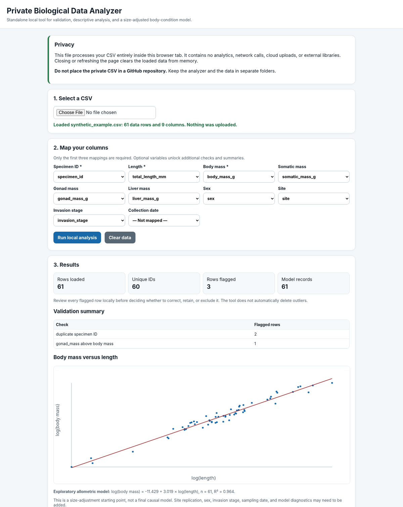

# Private Biological CSV Analyzer

**Version 1.1.0**

A local tool for checking a biological specimen CSV and computing descriptive
summaries and a regression you specify yourself. It runs in a browser tab on
your own machine. Nothing is uploaded, and no internet connection is used.

## Application Preview

## Easiest use

1. Unzip this folder.
2. Double-click `index.html`.
3. Select your CSV.
4. Map the requested columns.
5. Choose an analysis plan.
6. Click **Run local analysis**.
7. Optionally fill in the project-information form, then generate the
   governance and reproducibility report and download it as JSON or as a
   standalone HTML file.

No Python, terminal, package installation, account, or internet connection is
required.

Keep the whole folder together. `index.html` loads its code from the `js/` and
`css/` folders next to it, so moving `index.html` on its own will not work.

### Hosted-demo note

A GitHub Pages copy necessarily downloads the static HTML, CSS and JavaScript
files from GitHub when the page opens. The selected CSV is still processed in
the browser and is not uploaded by the application, but confidential datasets
should be analysed with a downloaded local copy opened from `index.html`.
Use the hosted page only with synthetic, public or otherwise approved data.

## Privacy

The analyzer never sends anything anywhere. Three separate measures enforce it:

- **No external references.** Every script, style and font is a local file.
  There are no CDNs, libraries, trackers or analytics of any kind.
- **A content security policy** in `index.html` declares `connect-src 'none'`
  and `default-src 'none'`, so the browser itself refuses to open a network
  connection or load a remote resource from this page.
- **A runtime kill switch** (`js/privacy.js`, loaded before everything else)
  disables `fetch`, `XMLHttpRequest`, `WebSocket`, `EventSource`,
  `RTCPeerConnection` and `navigator.sendBeacon`, and records any attempt to
  use them. The count is shown at the top of the page.

The only file the tool reads is the one you pick in the file dialog. There is
no drag-and-drop folder scan, no directory picker and no "recent files" list.
Nothing is written to `localStorage`, `sessionStorage`, cookies or IndexedDB, so
closing or refreshing the tab clears the loaded data from memory.

Downloads are generated in memory and saved by your own browser to your own
disk. Two further safeguards apply to what those files can contain:

- **Small groups are withheld.** A group summary covering fewer than five
  records is not reported — on screen or in any export — and neither is its
  label, since a label such as a specimen ID would identify the group by
  itself. What remains is a count of how many groups and records were withheld.
  This never changes the model, which is fitted from individual records.
- **File names are never exported.** The name of the CSV you opened is shown on
  screen but is deliberately not passed to any report builder, so it cannot
  reach a file you might share.

The only export that contains specimen identifiers is the flagged-row report,
which exists precisely so you can find and check those rows locally. The
governance report and the aggregate summary contain neither identifiers nor
individual values.

**Do not place the private CSV in a GitHub repository.** Keep the analyzer and
the data in separate folders.

## What it checks

Questionable values are **flagged and kept**. The tool never deletes, corrects
or silently drops a row — that decision belongs to the person who collected the
data.

| Check | Severity |
| --- | --- |
| Missing required value (specimen ID, length, body mass) | error |
| Non-numeric measurement | error / warning |
| Zero or negative measurement | error / warning |
| Duplicate specimen identifier | warning |
| Organ mass greater than body mass | warning |
| Organ mass greater than somatic mass (index above 100%) | warning |

"Error" means the value cannot be used in a calculation; "warning" means it is
arithmetically usable but deserves a look. Structural problems in the file
itself — ragged rows, duplicate or blank header names, an unterminated quote —
are reported separately when the file loads.

## What it computes

- **GSI** = 100 × gonad mass / somatic mass
- **HSI** = 100 × liver mass / somatic mass

Both use somatic mass as the denominator. That is a convention, not the only
one in use; confirm it matches your protocol before reporting these numbers.
The interface states how many rows each index could be computed for.

- **Disclosure-safe group summaries** (group size, mean, SD, and flagged-row count)
  for every combination of the grouping fields you tick. Groups containing fewer
  than five records are withheld together with their labels.
- **A least-squares regression** of the outcome on the predictors you choose,
  optionally on a log scale, reported with standard errors, t-statistics, R²
  and adjusted R².

## The analysis plan

Step 3 is where you say what should be computed:

- **Grouping fields** — any columns; summaries are reported per combination.
- **Outcome variable** — any numeric column, or the derived GSI or HSI.
- **Predictor variables** — one or more numeric variables (more than one gives
  a multiple regression).
- **Log transform** — when ticked, variables whose values are all positive are
  log-transformed. A variable containing a zero or a negative value is left on
  its original scale and the reason is reported. Rows are never dropped to make
  a logarithm possible.

The plan is echoed above the results, and included in the downloadable summary,
so any number can be traced back to the choices that produced it.

## The governance and reproducibility report

Step 6 produces a **Research Data Governance and Reproducibility Report**: an
aggregate account of what was analysed and how, meant to travel to a colleague,
a supervisor or a reviewer without the data travelling with it.

It records the application version, the analysis timestamp, the row and column
counts, the column mappings, per-column missingness percentages, the validation
rules applied together with their aggregate flag counts, the transformations
applied, the grouping variables, the outcome and predictor variables, a
description of the statistical model, and the limitations and interpretation
warnings that apply to it.

It does **not** record raw rows, specimen identifiers, file names, or any
individual value. Group summaries carry only a count, a mean and a standard
deviation: a minimum or a maximum is not a summary at all but one specimen's
recorded measurement, and a median is the same whenever the group size is odd.

Step 5 is an optional project-information form — project title, dataset owner
or custodian, intended scientific use, prohibited uses, permission or consent
status, retention and deletion plan, known sampling limitations, and potential
sources of bias. Every field is optional; blank answers are reported as
`(not stated)` rather than omitted, so the report shows what was asked as well
as what was answered. Nothing typed here is checked against the data.

Download it as **JSON** (for archiving or machine reading) or as a **standalone
HTML file** (one self-contained document with no scripts and no external
references, which opens correctly offline on any machine).

Given the same file, the same plan and the same timestamp, the report is
byte-identical every time — the timestamp is the only thing that varies between
runs, which is what makes a report reproducible rather than merely repeatable.

## Tests

Two runners execute the same test cases:

- **In a browser:** double-click `tests.html`. No server, no installation.
- **On the command line:** `node tests/run-tests.js`.

The browser runner executes 92 cases; the command-line runner executes 116. The
extra 24 are the ones that must read files, which a double-clicked page is not
allowed to do: an end-to-end pass over `synthetic_example.csv`, the governance
report built from that file, and a scan of the source files for anything that
could reach the network.

`synthetic_example.csv` is invented data for testing. It deliberately contains
one duplicated specimen ID and one gonad mass larger than the body mass, so the
flagging can be seen working.

## Scientific limitations

The regression is an exploratory, descriptive starting point. **No p-values are
reported**, because this tool cannot check the assumptions that would make them
meaningful, and nothing it prints establishes a biological effect.

A final research analysis may require:

- mixed-effects models;
- site-level replication checks;
- date or year effects;
- sex-specific models;
- nonlinear terms;
- residual diagnostics;
- sensitivity analyses;
- multiple-comparison control.

Those should be added only after the biological design and variable definitions
are confirmed.

See `TECHNICAL_REPORT.md` for the architecture, the validation rules and the
test inventory.
